  

  

    <h1>Hi, I'm Anthonyuff! 👋</h1>
    <ul>
        
📚 Undergraduate Student Geophysics at Universidade Federal Fluminense
        
🚀 I'm learning english
        
🐍 Currently studying Python and C++
      
🗻 I'm learning how to develop algorithms about seismic modeling 
       
### Languages and Tools 🛠 

        
   
### 👀 Visitors count

## 📊 GitHub stats

  

  

